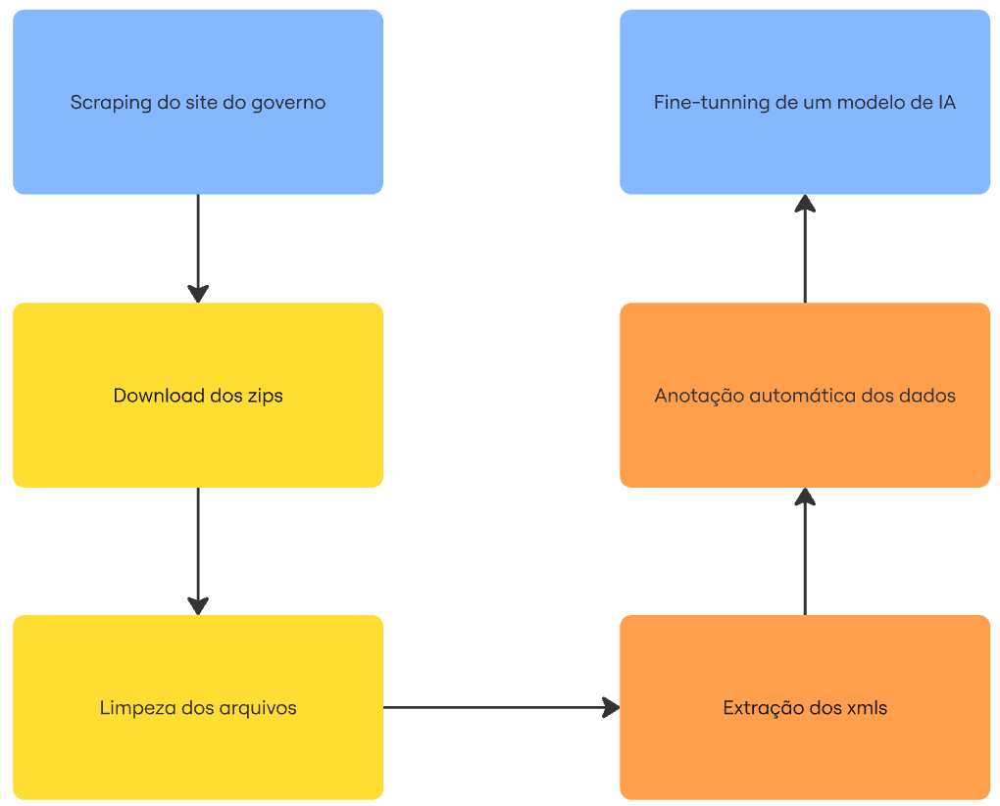

# crude_scraping_project

## Descrição
Este projeto realiza a raspagem de links de arquivos públicos do site do Diário Oficial da União, salva os links encontrados em um arquivo de texto e faz o download automático dos arquivos ZIP correspondentes. O objetivo é automatizar a coleta e o armazenamento desses dados para posterior análise ou processamento.

## Diagrama do pipeline


## Instruções de execução

1. **Clone o repositório e acesse a pasta:**
   ```sh
   git clone <url-do-repositorio>
   cd crude_scraping_project
   ```

2. **Crie e ative um ambiente virtual:**
   ```sh
   python -m venv venv
   venv\Scripts\activate   # No Windows
   # source venv/bin/activate  # No Linux/Mac
   ```

3. **Instale as dependências:**
   ```sh
   pip install -r requirements.txt
   ```

4. **Execute o script de raspagem para coletar os links:**
   ```sh
   python src/scraping.py
   ```

5. **Execute o script de download para baixar os arquivos ZIP:**
   ```sh
   python src/download.py
   ```

6. **Os arquivos baixados estarão na pasta `src/zips/`.**

## Licenças

Este projeto está licenciado sob a licença MIT. Consulte o arquivo [LICENSE](docs/LICENSE) para mais detalhes.
